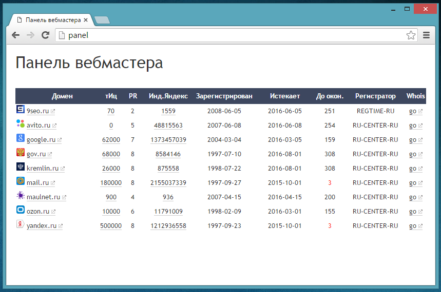

## Панель вебмастера.

Простой, бесплатный скрипт, позволяющий следить за множеством сайтов, отслеживая
основные показатели:

* дата регистрации домена;
* дата окончания регистрации домена;
* количество дней, оставшееся до окончания регистрации домена;
* тИЦ;
* PR;
* количество страниц в Яндексе;
* favicon;
* регистратор доменного имени.

## Скачать

Актуальная версия — [скачать v1.0](https://github.com/ref/webmaster.panel/releases/download/1.0/webmaster-panel_v1.0.zip)

### Установка

* распаковать загрузить на сервер в необходимую директорию;
* выставить права на запись файла cookie.txt;
* внести список доменов в файл config.php;
* ввести данные в файл config.php для авторизации на сервере xtool.ru(предварительно нужно зарегистрироваться);
* запустить index.php.

**Внимание!** Рекомендуется закрыть директорию со скриптом паролем,
т.к. доступ к информации о ваших проектах может быть получен третьими лицами.

### Дополнительная информация

Лицензия — BDS License (смотри файл LICENSE.md).

Используемые сторонние продукты:
* Whois.php (http://www.phpwhois.org);
* Сервис xtool.ru.